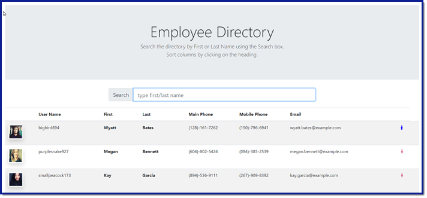
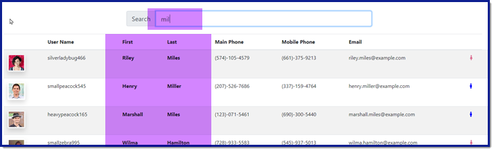
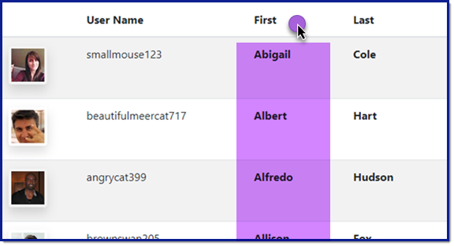
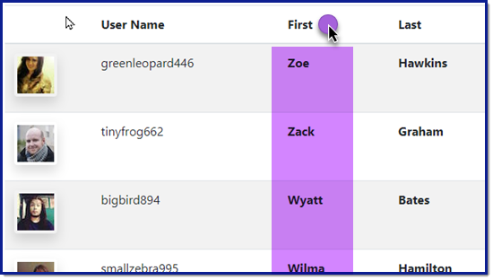

# React Employee Directory

### Unit 19 React Homework: Employee Directory

### User Story
* AS A user
* I WANT to be able to view my entire employee directory at once
* SO THAT I have quick access to their information.

## Description
For this assignment, I created an employee directory using React using components, managing component state, and responding to user events. The application uses axios to make an API call to a random, sample data set of users.  I'm returning 200 random users from this dataset therefore, if you refresh the page, you may get a different set of users than the previous load.

Access the deployed app here: https://cbayley-edu.github.io/employee-directory-react/

Access the git repo here: https://github.com/cbayley-edu/employee-directory-react


## Table of Contents 

* [Installation](#installation)
* [Usage](#usage)
* [License](#license)
* [Questions](#questions)

## Installation 

Since this is hosted on github pages, there is no installation required however, if you want to clone or fork my github repo, feel free to do so. After cloning my repo you will have to update information in the package.json.  You will need to run a few commands in the terminal as well:
* npm i  
* npm run build
* npm start  (this application is built to run locally on port 3000, which can be changed in server.js)

You can also build your own vanilla React app by running ```npx create-react-app APP_NAME``` in your terminal. (Replace APP_NAME with your app name.)

## Usage

Access the application here: https://cbayley-edu.github.io/employee-directory-react/

Welcome to the Employee Directory!



Use the search box to search the directory by First or Last Name. As you type in letters, the result set will update. It searches both the First Name or the Last Name and searches within the string (like/contains).



Click on a column heading to sort the data in ascending order.



Then click on the column heading again to sort the data in descending order.



You can sort ascending/descending by any column by clicking on the heading. You can also sort at any time - with or without search results.


## License 

[](https://opensource.org/licenses/MIT)

This project is covered by the above license(s). Click on the badge for more information.


## Questions 

GitHub username: cbayley-edu
GitHub profile link: https://github.com/cbayley-edu

Please email me at christinabayley@comcast.net with any questions you have or any issues you come across.

